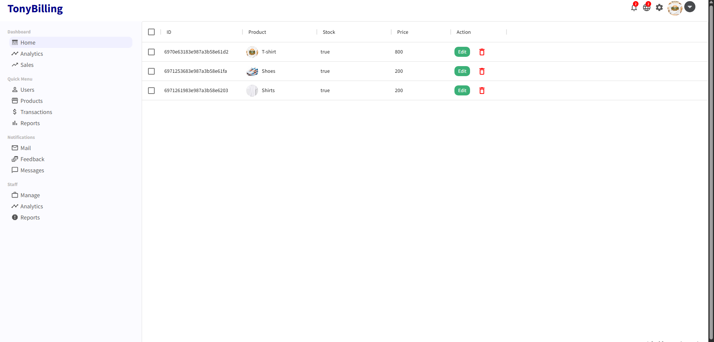
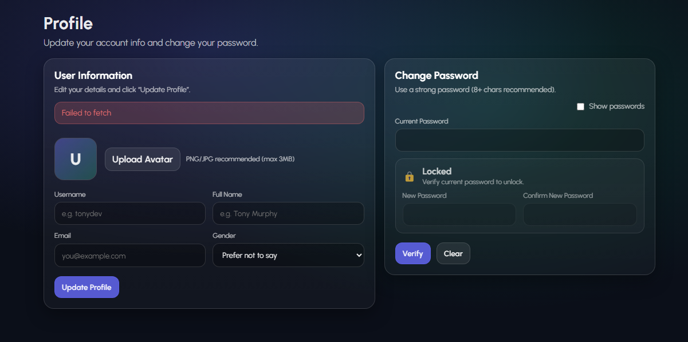
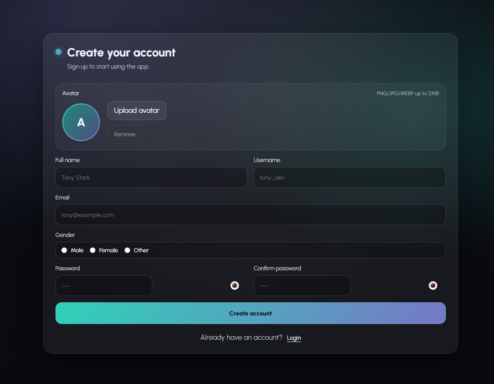

A fullstack e-commerce web application built with React (frontend) and Node.js (backend), integrated with Shopify Storefront API for product data, cart operations, and checkout-ready flows.

🔗 Repo: https://github.com/enka1504/fullstack-shopify-ecommerce

## 📸 Screenshots

### 🛍 Store Homepage

### 📦 Admin Dashboard (Products Management)

### 👤 User Profile + Password Update

### 📝 Register Page

## 🚀 Demo

Live demo: Coming soon ✅

✨ Features

✅ Modern UI with Tailwind CSS
✅ Shopify product listing & product details
✅ Full Cart system (add / remove / update quantity)
✅ Backend API with Node.js + Express
✅ CRUD operations (Products / Inventory management)
✅ JWT Authentication (login / protected routes)
✅ Scalable folder structure for real-world projects

🧰 Tech Stack

Frontend

React

React Router

Tailwind CSS

Backend

Node.js

Express.js

MongoDB (for user & inventory data)

JWT Authentication

Shopify

Storefront API

📁 Project Structure (Example)
fullstack-shopify-ecommerce/
client/ # React frontend
server/ # Node.js backend

⚙️ Setup & Installation

1. Clone the repo
   git clone https://github.com/enka1504/fullstack-shopify-ecommerce.git
   cd fullstack-shopify-ecommerce

🔥 Frontend Setup (React)
cd client
npm install
npm start

Frontend runs on:

http://localhost:3000

🚀 Backend Setup (Node.js)
cd server
npm install
npm run dev

Backend runs on:

http://localhost:5000

🔑 Environment Variables

Create a .env file inside your server folder:

PORT=5000
MONGO_URI=your_mongodb_connection_string
JWT_SECRET=your_secret_key

SHOPIFY_STORE_DOMAIN=your-store.myshopify.com
SHOPIFY_STOREFRONT_ACCESS_TOKEN=your_storefront_access_token

✅ You can get the Storefront Access Token from:
Shopify Admin → Apps → Develop apps → Storefront API

🛍 Shopify Storefront API Notes

This project uses Shopify Storefront API to:

Fetch products

Fetch product variants

Handle cart logic

🧪 API Endpoints (Example)
Method Endpoint Description
POST /api/auth/login Login user
POST /api/auth/register Register user
GET /api/products Get products
POST /api/products Create product
PUT /api/products/:id Update product
DELETE /api/products/:id Delete product

(Update these based on your real API routes)

✅ Roadmap (Next Improvements)

Add Checkout redirect via Shopify checkout URL

Add Admin dashboard UI

Add Order history page

Add Product search + filters

Improve validation + error handling

🤝 Contributing

Contributions are welcome!

Fork the repo

Create a new branch:

git checkout -b feature/my-feature

Commit your changes

Open a Pull Request

📜 License

MIT License (or update if different)

⭐ Support

If this project helped you, please consider giving it a ⭐ star!

If you want, I can also:
✅ make you a beautiful README with screenshots + GIF demo section
✅ create a “Run with Docker” guide
✅ improve your repo description + topics for more stars

yes

Perfect ✅ I’ll upgrade it even more for you.

Below is a 🔥 professional README v2 with:
✅ badges
✅ screenshots section
✅ quick start
✅ Docker (optional)
✅ clean formatting (helps people ⭐ star)

Copy/paste this into README.md 👇

Fullstack Shopify E-commerce 🛒

React + Node.js + Shopify Storefront API + Tailwind

A fullstack e-commerce project using React for the frontend, Node.js + Express for the backend, MongoDB for user/inventory data, and Shopify Storefront API for product + cart data.

🔗 GitHub Repo: https://github.com/enka1504/fullstack-shopify-ecommerce

✨ Features

✅ Shopify product listing & details
✅ Cart system (add/remove/update)
✅ Full CRUD (products / inventory management)
✅ JWT Authentication (login + protected routes)
✅ Responsive UI with Tailwind CSS
✅ Clean structure for real-world projects

🧰 Tech Stack

Frontend

React

React Router

Tailwind CSS

Backend

Node.js

Express.js

MongoDB

JWT Auth

Shopify

Storefront API

📸 Screenshots / Demo

Add screenshots here (this increases ⭐ stars a lot)

✅ Put images inside: client/src/assets/ or create folder screenshots/

Example:

### Home

### Product Page

### Cart

📁 Project Structure
fullstack-shopify-ecommerce/
client/ # React frontend
server/ # Node.js backend

⚙️ Installation & Run (Local)

1. Clone
   git clone https://github.com/enka1504/fullstack-shopify-ecommerce.git
   cd fullstack-shopify-ecommerce

2. Frontend
   cd client
   npm install
   npm start

Frontend runs on:
👉 http://localhost:3000

3. Backend
   cd server
   npm install
   npm run dev

Backend runs on:
👉 http://localhost:5000

🔑 Environment Variables

Create .env inside server/

PORT=5000
MONGO_URI=your_mongodb_connection_string
JWT_SECRET=your_secret_key

SHOPIFY_STORE_DOMAIN=your-store.myshopify.com
SHOPIFY_STOREFRONT_ACCESS_TOKEN=your_storefront_access_token

✅ Get Storefront token from:
Shopify Admin → Apps → Develop apps → Storefront API

🧪 API Routes (Example)
Method Route Description
POST /api/auth/login Login
POST /api/auth/register Register
GET /api/products Get products
POST /api/products Create product
PUT /api/products/:id Update product
DELETE /api/products/:id Delete product

Update based on your actual code routes.

🐳 Run with Docker (Optional)

1. Create docker-compose.yml in root
   version: "3.9"

services:
server:
build: ./server
ports: - "5000:5000"
env_file: - ./server/.env
depends_on: - mongo

client:
build: ./client
ports: - "3000:3000"
depends_on: - server

mongo:
image: mongo:6
ports: - "27017:27017"
volumes: - mongo_data:/data/db

volumes:
mongo_data:

2. Add Dockerfile in server/
   FROM node:18

WORKDIR /app
COPY package\*.json ./
RUN npm install
COPY . .
EXPOSE 5000
CMD ["npm", "run", "dev"]

3. Add Dockerfile in client/
   FROM node:18

WORKDIR /app
COPY package\*.json ./
RUN npm install
COPY . .
EXPOSE 3000
CMD ["npm", "start"]

4. Run
   docker-compose up --build

✅ Roadmap (Next)

Add checkout redirect (Shopify checkout URL)

Admin dashboard UI

Product search + filters

Order history page

Better error handling + loading skeletons

⭐ Support

If you like this project, please give it a ⭐ star
It helps me a lot 🙌

🤝 Contributing

PRs are welcome!

git checkout -b feature/your-feature
git commit -m "Add feature"
git push origin feature/your-feature
